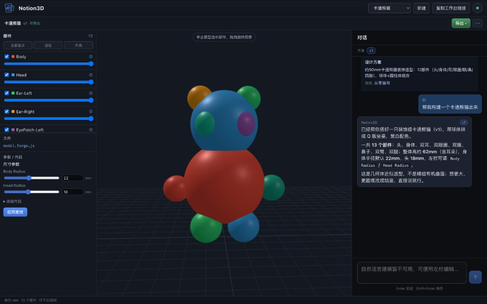

# Notion3D — ForgeCAD 装配工作台

<p align="center">
  
</p>

<p align="center"><em>自然语言建模 → ForgeCAD 装配 → 三栏工作台预览与精修</em></p>

用自然语言描述需求，外部 Agent 写 ForgeCAD 脚本，Engine 渲染多部件装配，**Web 三栏工作台**预览与导出。

**Notion3D 引擎不含 LLM**。建模智能经**技术接口**接入（MCP / 可选 Web Turn）；Web UI 对用户无感——用户只打开工作台，不关心 Agent 叫什么、配在哪。

## 特性

- **ForgeCAD 装配**：`.forge.js` → STL + `parts.json` 分件预览
- **三栏工作台**：结构 · 3D 视口 · 对话
- **部件精修**：部件树 → Forge 源码跳转
- **Forge 实时预览**：ForgeCAD Studio `:5174`
- **Design Turn 流水线**：plan → author → render → review

## 架构（一句话）

```
用户 → Web 工作台 :5173 → Engine :8000 → forge-runner
                ↑
Agent 宿主 ── MCP(notion3d-mcp) ──┘          ← 接口 1（默认推荐）
可选：Web POST /turn → Web Turn sidecar ──────── 接口 2
可选：Web 左栏手动改 Forge ──────────────────── 接口 3
```

三条路径**平行**，共用同一 Web 工作台。详见 [docs/architecture.md](docs/architecture.md)。

## 依赖与前置条件

| 系统 | 要求 |
|------|------|
| Python | **3.11+** |
| Node.js | **20+**（含 npm） |
| git | 拉取 ForgeCAD npm 依赖 |

```bash
make install    # api + mcp-server + forge-runner + web + agent-bridge
cp .env.example .env
```

**LLM 不在 Notion3D 内**——按路径由外部提供：

| 路径 | LLM 由谁提供 |
|------|--------------|
| MCP 建模 | Agent 宿主（OpenClaw 等） |
| Web Turn · bridge | Cursor 云端（`CURSOR_API_KEY`） |
| Web Turn · gateway | gateway 宿主（当前实现 Hermes） |
| 手动编辑 | 无 |

完整依赖表、包级清单、环境变量索引：[docs/dependencies.md](docs/dependencies.md)

## 使用方式与网络

**谁在哪打开 Web、链接用什么地址**——与「装什么依赖」分开说明。

| 场景 | 你怎么用 | Web 地址 | 配置 |
|------|----------|----------|------|
| **本机 Local** | 浏览器与 `make dev` 同一台电脑 | http://localhost:5173 | 默认 `.env` 即可 |
| **局域网 LAN** | 同事 / 手机同一 Wi‑Fi 看模型 | `http://<主机 IP>:5173` | 改 `NOTION3D_WEB_BASE` 为 IP |
| **LAN + 异机 Agent** | Agent 在另一台内网 PC | 同上 | MCP env 中 `API_BASE` / `WEB_BASE` 均用主机 IP |

```bash
make dev
# banner 示例：
#   Web  http://localhost:5173
#        http://192.168.1.42:5173  （局域网）
```

局域网需改 `.env` 后重启：

```env
NOTION3D_WEB_BASE=http://192.168.1.42:5173
NOTION3D_CORS_ORIGINS=http://localhost:5173,http://127.0.0.1:5173,http://192.168.1.42:5173
```

完整步骤、MCP 异机、故障排查：[docs/usage-network.md](docs/usage-network.md)

## 建议部署

按你的使用方式选一种（或组合）。**Notion3D 侧**始终是 `make dev` 起 Engine + Web；差别在是否加 Web Turn、以及 **Agent 宿主侧**是否配 MCP。

### 方案 A — MCP 建模（推荐，含 OpenClaw）

**适合**：在 Agent 宿主里对话建模，Web 只做预览、编辑、导出。

| 层 | 做什么 |
|----|--------|
| Notion3D | `make dev`（`WEB_TURN=off`，默认） |
| Agent 宿主 | 配置 `notion3d-mcp`，env 指向 Engine / Web |
| LLM | **宿主侧**配置（Notion3D 不包含） |
| 用户 | 宿主内对话 → Web 打开预览链接（本机 `localhost`；内网见 [usage-network.md](docs/usage-network.md)） |

```bash
make install
cp .env.example .env   # 填 NOTION3D_WEB_BASE 等
make dev
# → Web http://localhost:5173  ·  API http://127.0.0.1:8000
```

Agent 宿主 MCP env（示例）：

```json
{
  "command": "notion3d-mcp",
  "env": {
    "NOTION3D_API_BASE": "http://127.0.0.1:8000",
    "NOTION3D_WEB_BASE": "http://localhost:5173"
  }
}
```

OpenClaw 合并 [config/openclaw-notion3d-mcp.json](config/openclaw-notion3d-mcp.json) → [docs/agents/openclaw.md](docs/agents/openclaw.md)

---

### 方案 B — 浏览器内对话（Web Turn · bridge）

**适合**：用户直接在 Web 右侧「对话」输入，不经外部 Agent 宿主。

| 层 | 做什么 |
|----|--------|
| Notion3D | `make dev WEB_TURN=bridge` |
| Sidecar | agent-bridge `:8787` → `@cursor/sdk` → **notion3d-mcp** → Engine |
| LLM | **Cursor 云端**（`.env` 中 `CURSOR_API_KEY`） |
| 用户 | 本机浏览器打开 Web（`localhost` 或内网 IP）→ 右侧对话 |

```bash
make install
cp .env.example .env
# .env:
#   CURSOR_API_KEY=crsr_...
make dev WEB_TURN=bridge
```

详见 [docs/agents/web-turn-bridge.md](docs/agents/web-turn-bridge.md)

---

### 方案 C — 浏览器内对话（Web Turn · gateway）

**适合**：已有 HTTP Runs gateway 宿主，希望在 Web 内对话。

| 层 | 做什么 |
|----|--------|
| Notion3D | `make dev WEB_TURN=gateway` |
| Sidecar | gateway HTTP API `:8642` → Agent + **notion3d-mcp** → Engine |
| LLM | **gateway 宿主侧**（当前实现 Hermes；Notion3D 不包含） |
| 部署层 | gateway CLI + `HERMES_API_SERVER_KEY`；宿主侧 notion3d MCP |

```bash
make install
cp .env.example .env
# .env:
#   HERMES_API_SERVER_KEY=...
make dev WEB_TURN=gateway
```

详见 [docs/agents/web-turn-gateway.md](docs/agents/web-turn-gateway.md)

---

### 方案 D — 纯手动（无 Agent）

**适合**：只改 Forge 参数/代码/部件精修，不用自然语言建模。

```bash
make dev    # 与方案 A 相同栈，不配 MCP 亦可使用左栏编辑
```

---

### 对照表

| 你想… | 启动 | Notion3D `.env` | 外部依赖 |
|-------|------|-----------------|----------|
| OpenClaw / MCP 建模 | `make dev` | `NOTION3D_WEB_BASE` | Agent 宿主 + LLM + `notion3d-mcp` |
| Web 内对话（bridge） | `make dev WEB_TURN=bridge` | + `CURSOR_API_KEY` | Cursor API；sidecar 内 `notion3d-mcp` |
| Web 内对话（gateway） | `make dev WEB_TURN=gateway` | + gateway key | Hermes CLI + 宿主 LLM + MCP |
| 只手动改 Forge | `make dev` | 工作台 env | 无 |

> Web 对话与 MCP 建模可并存：例如 `make dev WEB_TURN=bridge` 同时在外部宿主用 MCP 调同一 Engine。

## 快速开始

```bash
make install
make dev
```

自检：

```bash
curl -s http://127.0.0.1:8000/health | python3 -m json.tool
# forgecad_available: true · web_turn: off
WEB_TURN=off bash scripts/check-dev-stack.sh
```

不要用裸 `make api` 代替 `make dev`（缺 Web 与 forge-runner 预检）。

## 文档

| 文档 | 说明 |
|------|------|
| [docs/usage-network.md](docs/usage-network.md) | **本机 / 局域网** 谁在哪访问、URL 怎么配 |
| [docs/dependencies.md](docs/dependencies.md) | **依赖、LLM 归属、环境变量** |
| [docs/agents/README.md](docs/agents/README.md) | 三条路径与接口详解 |
| [docs/architecture.md](docs/architecture.md) | 架构、Engine API、MCP 表 |
| [AGENTS.md](AGENTS.md) | MCP 工具与 Skills 速查 |
| [docs/design-pipeline.md](docs/design-pipeline.md) | Design Turn 流水线 |
| [docs/dev-modes.md](docs/dev-modes.md) | 本地端口与 `WEB_TURN` |
| [docs/cad-backend-v2.md](docs/cad-backend-v2.md) | ForgeCAD 安装与渲染 |
