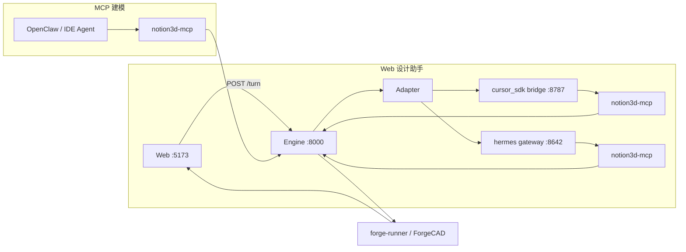

# Agent 接入

Notion3D **不含 LLM**。建模智能由外部 Agent 提供；按你的环境选一条路径。

## 架构概览



| 路径 | 入口 | 典型场景 |
|------|------|----------|
| **Web 对话** | Web 设计助手面板 | 浏览器内自然语言建模 |
| **MCP** | OpenClaw / Cursor IDE / Claude Code | 外部 Agent 调 Engine |
| **手动** | Web 左栏 | 改参数 / Forge 代码 / 部件精修 |

MCP 工具与工作流：[AGENTS.md](../../AGENTS.md) · 分阶段流水线：[design-pipeline.md](../design-pipeline.md)

## 选路径

| 你的 Agent 环境 | 用途 | 启动 | 文档 |
|-----------------|------|------|------|
| **Cursor SDK** | Web 设计助手对话 | `make dev AGENT=cursor_sdk` | [Web · cursor_sdk](#web--cursor_sdk) |
| **Hermes** | Web 设计助手对话 | `make dev AGENT=hermes` | [hermes.md](hermes.md) |
| **OpenClaw** | OpenClaw 经 MCP 建模 | `make dev AGENT=engine` + 配置 MCP | [openclaw.md](openclaw.md) |
| **Cursor IDE / Claude Code** | IDE 内 Agent 经 MCP | `make dev AGENT=engine` + 配置 MCP | [integrations/README.md](../integrations/README.md) |
| **无 Agent** | Web 预览、左栏改 Forge | `make dev AGENT=engine` | [Web · engine](#web--engine) |

## 快速对照

| `AGENT` | Web 对话 | Sidecar | MCP 配置位置 |
|---------|----------|---------|--------------|
| `cursor_sdk` | ✓ | `agent-bridge` `:8787` | bridge 内 spawn |
| `hermes` | ✓ | `hermes gateway` `:8642` | `~/.hermes/config.yaml` |
| `engine` | ✗ | 无 | OpenClaw / IDE 自行配置 |

不要用裸 `make api` 代替 `make dev`（缺 Web、sidecar 或 forge-runner 预检）。

---

## Web · cursor_sdk

**前置**：`.env` 中 `CURSOR_API_KEY` · `make install`（含 forge-runner、notion3d-mcp、agent-bridge）

```env
# 项目根 .env
CURSOR_API_KEY=crsr_...
```

```bash
make install
make dev AGENT=cursor_sdk
```

| 进程 | 端口 | 职责 |
|------|------|------|
| agent-bridge | 8787 | `@cursor/sdk` + notion3d MCP |
| API | 8000 | Engine |
| Web | 5173 | 工作台 |

打开 Web（`http://localhost:5173` 或局域网 `http://<本机 IP>:5173`）。设计助手显示 **已连接**。

```bash
curl -s http://127.0.0.1:8000/health | grep -E 'web_chat_mode|agent_active|forgecad_available'
# web_chat_mode: agent · agent_active: cursor_sdk · forgecad_available: true
```

数据流：`Web POST /turn` → bridge → Cursor Agent（Skills + MCP）→ `render_forge` → ForgeCAD → Web 装配预览。

---

## Web · hermes

完整步骤见 **[hermes.md](hermes.md)**（Hermes MCP、`API_SERVER_KEY`、gateway 验证）。

```bash
make install
make dev AGENT=hermes
```

Sidecar：`hermes gateway` `:8642`。Session ID：`notion3d-{project_id}`。

---

## OpenClaw

完整步骤见 **[openclaw.md](openclaw.md)**。

```bash
make install
make dev AGENT=engine
```

将 [config/openclaw-notion3d-mcp.json](../../config/openclaw-notion3d-mcp.json) 合并进 `~/.openclaw/openclaw.json` 的 `mcp.servers`，重启 OpenClaw gateway。

在 OpenClaw 中调用 `notion3d_*` 工具。建模完成后 Web 预览：

```
http://localhost:5173/p/<project_id>
```

---

## Web · engine

```bash
make install
make dev AGENT=engine
```

启动 API `:8000` 与 Web `:5173`，无设计助手 sidecar。适用场景：

- OpenClaw / Cursor IDE / Claude Code 经 MCP 调 Engine
- Web 左栏手动改 ForgeCAD：
  - **参数**：`param()` 滑块，改完重新渲染
  - **代码**：主脚本 + `src/` 多文件
  - **部件精修**：点选部件树 → 跳转对应 Forge 片段（需 `parts.json` 含 `source_ref`）

IDE MCP 配置见 [integrations/README.md](../integrations/README.md)。

---

## 局域网访问

```bash
make dev AGENT=<你的 profile>
```

局域网内其他设备打开 `http://<运行 dev 机器的 IP>:5173`（`make dev` 启动 banner 会打印该地址）。

分享项目链接时，在 `.env` 设置：

```env
NOTION3D_WEB_BASE=http://<IP>:5173
```

Web 设计助手（`cursor_sdk` / `hermes`）的 sidecar 在运行 `make dev` 的本机；局域网设备可正常使用对话。OpenClaw / IDE / Hermes MCP 的 `NOTION3D_WEB_BASE` 也需与上述地址一致。

---

## 验证

```bash
curl -s http://127.0.0.1:8000/health | python3 -m json.tool
```

| 字段 | 期望 |
|------|------|
| `forgecad_available` | `true` |
| `web_chat_mode` | `agent`（cursor_sdk / hermes）或 `setup_required`（engine / OpenClaw） |
| `agent_active` | `cursor_sdk` / `hermes` / `null` |

Web 内 **助手** 面板可查看 `cursor_sdk` / `hermes` 就绪状态。

启动后自检：

```bash
AGENT=cursor_sdk bash scripts/check-dev-stack.sh
# 或 AGENT=hermes bash scripts/check-dev-stack.sh
```

---

## 故障排查

| 现象 | 检查 |
|------|------|
| 助手「未连接」 | `curl :8787/health`（cursor_sdk）或 `:8642/health`（hermes）；`.env` 中 key 是否配置 |
| `forgecad_available: false` | `cd apps/forge-runner && npm install` |
| 有回复无模型 | Job 日志；Agent 是否调 `notion3d_render_forge` + `notion3d_wait_job` |
| MCP 工具不可用 | `notion3d-mcp` 在 PATH；Engine `:8000` 已起；MCP env 中 `NOTION3D_API_BASE` |
| 部件精修无法跳转 | Forge 脚本需 `const partId = ...` + `return [{ name, shape: partId }]`；重新渲染生成 `source_ref` |
| 局域网链接打不开 | `.env` 中 `NOTION3D_WEB_BASE` 与 MCP env 一致；防火墙放行 `:5173` |

---

## 代码

```
scripts/dev.sh
apps/agent-bridge/              # cursor_sdk
apps/api/app/services/agents/   # cursor_sdk.py, hermes.py
apps/mcp-server/                # notion3d-mcp（OpenClaw / IDE / Hermes / bridge）
config/
  openclaw-notion3d-mcp.json
  hermes-notion3d-mcp.yaml
```
