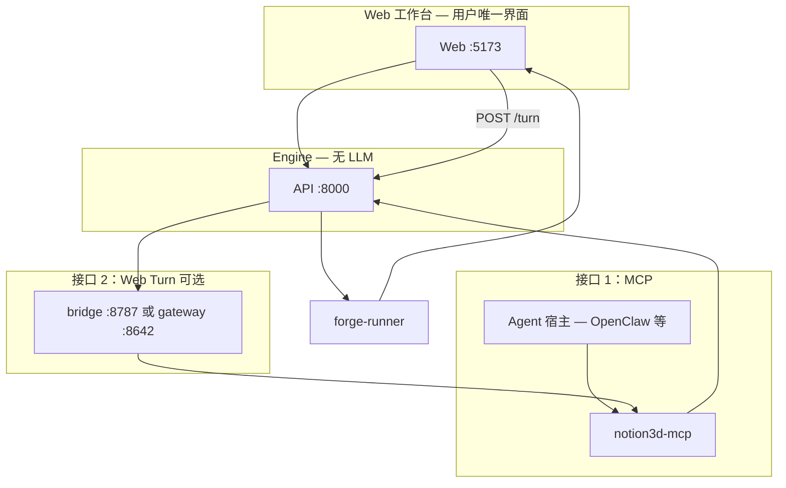

# Agent 接入

Notion3D **不含 LLM**。建模智能由外部 Agent 经**技术接口**接入；Web 工作台对用户无感。

## 三条平行路径

| 路径 | 技术接口 | 用户入口 | 部署配置 |
|------|----------|----------|----------|
| **MCP 建模** | `notion3d-mcp` → Engine REST | Agent 宿主内对话；Web 预览/编辑 | `make dev`（默认）+ 宿主侧 MCP |
| **Web 对话** | Web Turn sidecar → MCP → Engine | Web 右侧「对话」 | `make dev WEB_TURN=bridge\|gateway` |
| **手动编辑** | Engine REST `render-forge` | Web 左栏参数/代码/精修 | `make dev` |

三条路径**同级**。OpenClaw 等 Agent 宿主走 **MCP**；不是「备选方案」。

**依赖与 LLM 归属**（完整表）：[dependencies.md](../dependencies.md)

**本机 / 局域网谁在哪访问**：[usage-network.md](../usage-network.md)

| 路径 | LLM 由谁提供 |
|------|--------------|
| MCP | Agent 宿主 |
| Web Turn · bridge | Cursor 云端（`CURSOR_API_KEY`） |
| Web Turn · gateway | gateway 宿主（当前 Hermes） |
| 手动 | 无 |

## 架构



## 启动（部署层）

```bash
make install
make dev                    # Engine + Web，MCP 路径（默认）
make dev WEB_TURN=bridge    # + agent-bridge（浏览器内对话）
make dev WEB_TURN=gateway   # + HTTP Runs gateway
```

不要用裸 `make api` 代替 `make dev`。

| `WEB_TURN` | 进程 | 端口 |
|------------|------|------|
| `off`（默认） | API + Web | 8000 / 5173 |
| `bridge` | + agent-bridge | 8787 |
| `gateway` | + gateway sidecar | 8642 |

兼容旧变量（将废弃）：`AGENT=engine→off`，`cursor_sdk→bridge`，`hermes→gateway`。

## 接口 1：MCP（推荐 / OpenClaw 等）

Agent 宿主配置 **notion3d-mcp** 指向 Engine：

```json
{
  "command": "notion3d-mcp",
  "env": {
    "NOTION3D_API_BASE": "http://127.0.0.1:8000",
    "NOTION3D_WEB_BASE": "http://localhost:5173"
  }
}
```

- OpenClaw 示例：[openclaw.md](openclaw.md)
- 通用 MCP 宿主：[integrations/README.md](../integrations/README.md)
- 工具与工作流：[AGENTS.md](../../AGENTS.md)

建模完成后 Web 预览：`NOTION3D_WEB_BASE/p/<project_id>`（本机默认 `localhost`；内网见 [usage-network.md](../usage-network.md)）

## 接口 2：Web Turn（可选）

启用浏览器内 `POST /turn` 时，Engine 经 sidecar 转发到 Agent 运行时（仍通过 notion3d-mcp 建模）。

| Sidecar | 配置 | 文档 |
|---------|------|------|
| `bridge` | `CURSOR_API_KEY` + `notion3d-mcp`（sidecar 内） | [web-turn-bridge.md](web-turn-bridge.md) |
| `gateway` | gateway CLI + API key + 宿主 MCP/LLM | [web-turn-gateway.md](web-turn-gateway.md) |

浏览器内对话时，外部脚本或第二 Agent 可用 MCP **`notion3d_wait_agent`** 等待本轮 Web Turn 结束（SSE + 轮询降级）；快照用 **`notion3d_get_project_state`**。详见 [web-turn-bridge.md § MCP 辅助工具](web-turn-bridge.md#mcp-辅助工具web-turn)。

Web 对话还支持：**附截图**（视口截取 / 粘贴 / 选文件，最多 3 张）。`WEB_TURN=bridge` 时经 `@cursor/sdk` 传入 Agent 视觉通道；Agent 应结合 `wait_job` 的 **`spatial_summary`** / **`validation_warnings`** 做 review。`gateway` 模式暂仅文本提示，视觉以 MCP 摘要为主。

## 接口 3：手动编辑

`make dev` 即可。Web 左栏改 Forge 参数/代码/部件精修，不经 LLM。

## 验证

```bash
curl -s http://127.0.0.1:8000/health | python3 -m json.tool
```

| 字段 | 含义 |
|------|------|
| `forgecad_available` | Forge 渲染就绪 |
| `web_turn` | `off` / `bridge` / `gateway` |
| `web_chat_mode` | `agent`（Web 对话可用）或 `setup_required` |

```bash
WEB_TURN=off bash scripts/check-dev-stack.sh
```

## 故障排查

| 现象 | 检查 |
|------|------|
| Web 对话不可用 | 部署层 `WEB_TURN`；`web_turn_ready`；非 Web UI 配置问题 |
| MCP 工具失败 | `notion3d_health`；Engine `:8000`；MCP env |
| `forgecad_available: false` | `cd apps/forge-runner && npm install` — 见 [dependencies.md](../dependencies.md) |

## 代码

```
scripts/dev.sh
apps/mcp-server/           # 接口 1
apps/agent-bridge/         # Web Turn bridge
apps/api/app/services/agents/  # bridge / gateway adapters
config/openclaw-notion3d-mcp.json
```

完整 API / MCP 表：[architecture.md](../architecture.md)
