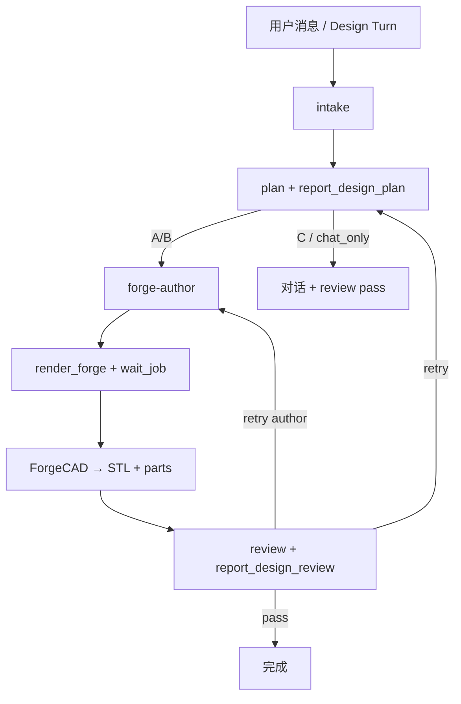

# Notion3D 设计流水线

LLM 设计 与 ForgeCAD Engine 渲染分离，Agent 按 Skill 分阶段执行。

## 流程



## Skills

```
.cursor/skills/
  notion3d-pipeline/      总览
  notion3d-intake/
  notion3d-plan/
  notion3d-forge-author/
  notion3d-mcp/
  notion3d-review/
```

## 禁止

- 跳过 plan 直接写复杂装配
- 单轮完成 intake + author + review
- Agent 新建模走 legacy OpenSCAD（见 [architecture.md](architecture.md#legacy-engine-保留)）

## 相关

- [AGENTS.md](../AGENTS.md) — MCP 工作流
- [cad-backend-v2.md](cad-backend-v2.md) — 渲染产物
