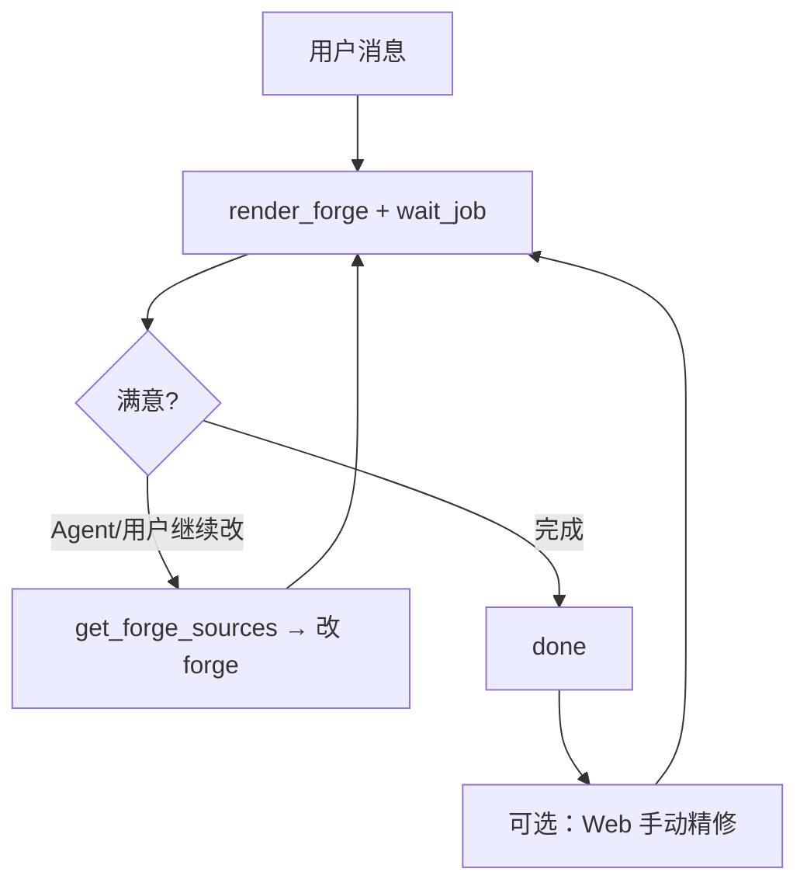

# Notion3D 设计流水线

Agent-native **render-first** 循环：写 Forge → 渲染 → 读反馈 → 迭代。Engine 不含 LLM；真源：[forge-modeling-guide.md](forge-modeling-guide.md)。

## 主循环

## Design Phase（Engine 记录，非 Agent 门禁）

| Phase | 含义 |
|-------|------|
| `author` | turn 开始；Agent 可建模 / render |
| `render` | Job 运行中 |
| `review` | 渲染成功，等待 Agent 回复（可选） |
| `done` | turn 结束 |
| `blocked` | Agent 运行失败 |

`plan` / `intake` 仍存在于 schema，供可选 `report_design_plan` 与 UI 兼容。

实现：`apps/api/app/services/design_turn.py`

## 可选归档

| 端点 / MCP | 用途 |
|------------|------|
| `report_design_plan` | 多部件时记录 summary / assembly_spec / geometry_recipes |
| `report_design_review` | 显式验收记录（Engine 也会在 render 成功后 auto-complete） |

## Agent 环境

| 环境 | 执行方式 |
|------|----------|
| MCP 宿主 | MCP tools |
| Web 对话 | Web Turn sidecar → MCP |
| 手动 | Web 左栏 → `POST /render-forge` |

## Engine 行为

| 情况 | Engine |
|------|--------|
| 直接 `render_forge` 无 plan | `ensure_implicit_plan` 事后补 metadata |
| `validation_warnings` | **不阻塞**交付；装配/建模建议写入 digest |
| render 成功 + Agent 已回复 | **auto-complete** turn（warnings 记入 review notes） |
| `report_design_review(retry)` | 最多 **8** 次 revision |

HTTP：

- `POST /api/projects/{id}/design/plan`
- `POST /api/projects/{id}/design/review`
- `GET /api/projects/{id}/design/state`

详见 [architecture.md](architecture.md) · [AGENTS.md](../AGENTS.md)。
