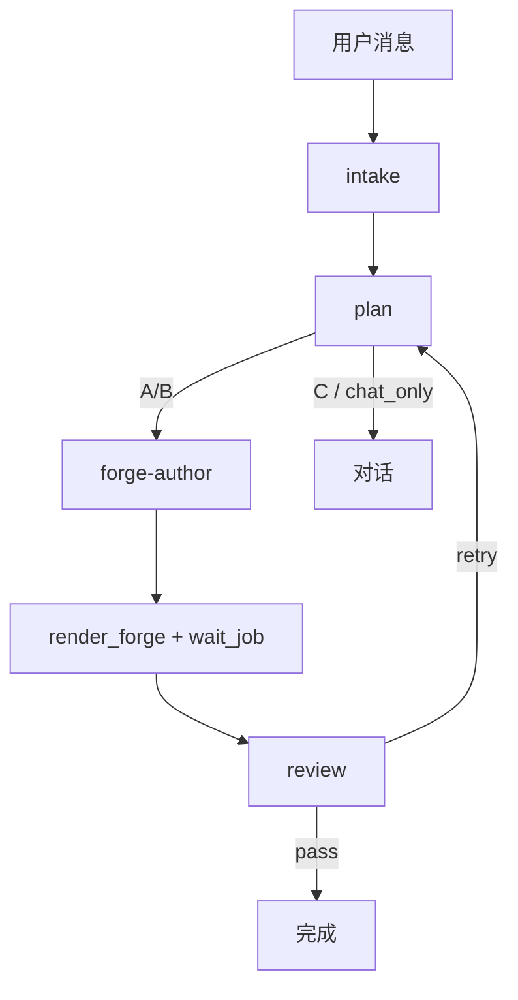

# Notion3D 设计流水线

Agent 按 Skill 分阶段执行；Engine 只负责 ForgeCAD 渲染。

## 流程

## Skills

`notion3d-pipeline` → `intake` → `plan` → `forge-author` → `mcp` → `review`

## 禁止

- 跳过 plan 直接写复杂装配
- 单轮完成 intake + author + review

详见 [AGENTS.md](../AGENTS.md)。
