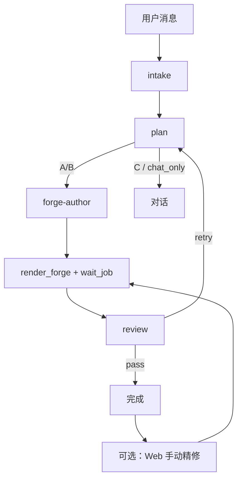

# Notion3D 设计流水线

Agent 按 Skill 分阶段执行；Engine 只负责 ForgeCAD 渲染。Web 左栏可手动改稿（参数 / 代码 / 部件精修），不经 Agent 也可重新渲染。

## 流程

## Skills

`notion3d-pipeline` → `intake` → `plan` → `forge-author` → `mcp` → `review`

## Agent 环境

| 环境 | 如何执行流水线 |
|------|----------------|
| OpenClaw / IDE | MCP tools（见 [AGENTS.md](../AGENTS.md)） |
| Web 对话 | cursor_sdk / hermes sidecar 自动调 MCP |
| 手动 | Web 左栏改 Forge → `POST /render-forge` |

接入说明：[agents/README.md](agents/README.md)

## 禁止

- 跳过 plan 直接写复杂装配
- 单轮完成 intake + author + review

Engine 会在 Agent 跳步时自动生成 implicit plan / 自动 pass review。

详见 [AGENTS.md](../AGENTS.md)。
