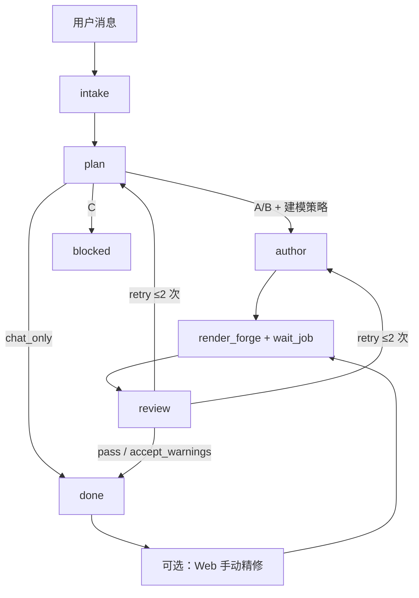

# Notion3D 设计流水线

Agent 按 Skill 分阶段执行；Engine 只负责 ForgeCAD 渲染。Web 左栏可手动改稿（参数 / 代码 / 部件精修），不经 Agent 也可重新渲染。

## 流程

## Design Phase

| Phase | 触发 |
|-------|------|
| `intake` | `POST /turn` 或 MCP 会话开始 |
| `plan` | 等待 `report_design_plan` |
| `author` | plan 已记录且非 blocked |
| `render` | `render_forge` 提交 Job |
| `review` | Job 成功 |
| `done` | review pass / accept_warnings / chat_only |
| `blocked` | task_class C 或 Agent 失败 |

实现：`apps/api/app/services/design_turn.py`

## Skills

`notion3d-pipeline` → `intake` → `plan` → `forge-author` → `mcp` → `review`

## Agent 环境

| 环境 | 如何执行流水线 |
|------|----------------|
| MCP 宿主 | MCP tools（见 [AGENTS.md](../AGENTS.md)） |
| Web 对话 | Web Turn sidecar 自动调 MCP |
| 手动 | Web 左栏改 Forge → `POST /render-forge` |

接入说明：[agents/README.md](agents/README.md)

## 禁止

- 跳过 plan 直接写复杂装配
- 单轮完成 intake + author + review

## Engine 兜底

Agent 跳步时 Engine 不会阻塞渲染，但会补记录：

| 情况 | Engine 行为 |
|------|-------------|
| 未调 `report_design_plan` 直接 `render_forge` | 自动生成 **implicit plan**（`task_class=A`，`strategy=from_scratch`，summary 取自 job label） |
| 渲染成功但未调 `report_design_review` | 在 Agent 回复后 **auto pass review** |
| review 返回 `retry` | `revision` +1；最多 **2 次**（`MAX_DESIGN_REVISION`），超限则拒绝并提示手动编辑 |

plan / review 的 HTTP 端点：

- `POST /api/projects/{id}/design/plan`
- `POST /api/projects/{id}/design/review`
- `GET /api/projects/{id}/design/state`

详见 [architecture.md](architecture.md) · [AGENTS.md](../AGENTS.md)。
