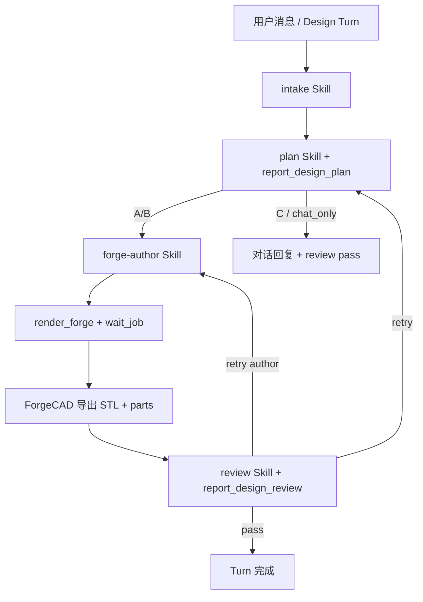

# Notion3D 设计流水线

Notion3D 将 **LLM 设计** 与 **ForgeCAD Engine 渲染** 分离，Agent 按阶段 Skill 执行。

## 流程



Legacy OpenSCAD：`notion3d-author` + `render_scad`（`templates/legacy/scad/`）。

## Skills 目录

```
.cursor/skills/
  notion3d-openscad/      # 总览
  notion3d-intake/
  notion3d-plan/
  notion3d-forge-author/  # 主 author
  notion3d-author/        # legacy SCAD only
  notion3d-mcp/
  notion3d-review/
```

## MCP Tools

- `notion3d_report_design_plan`
- `notion3d_render_forge`（主）
- `notion3d_render_scad`（legacy）
- `notion3d_report_design_review`

详见 [cad-backend-v2.md](cad-backend-v2.md)。

## 禁止模式

- 新模型跳过 plan 直接 from_scratch 复杂装配
- 新模型走 `render_scad`（除非 legacy 模板）
- 单 Agent 一次调用完成 intake+author+review

## 相关文档

- [architecture.md](architecture.md)
- [cad-backend-v2.md](cad-backend-v2.md)
